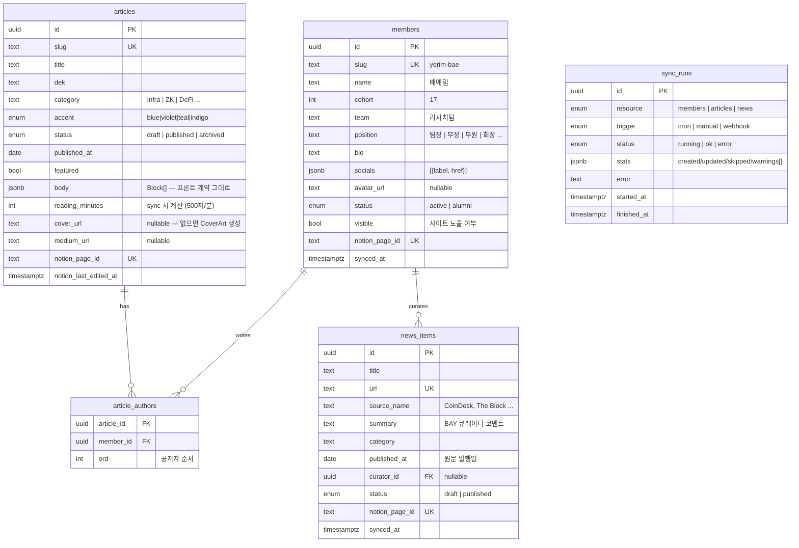

# BAY 백엔드 설계 — 인원관리 · 리서치 · 뉴스트래킹

스택: **NestJS + PostgreSQL (Prisma)** · 콘텐츠 저작: **Notion** · 프론트: 기존 Next.js 사이트

## 0. 설계 원칙

**Notion이 어드민이다.** 학회 운영진이 이미 쓰는 Notion을 저작·관리 UI로 삼고,
백엔드는 Notion → PostgreSQL 동기화 + 읽기 전용 API만 담당한다.
어드민 페이지를 따로 만들지 않는 것이 이 설계의 가장 큰 결정이다.

```
┌─────────┐   sync (cron/webhook)   ┌────────────┐   REST(JSON)   ┌──────────┐
│ Notion  │ ──────────────────────▶ │  NestJS    │ ─────────────▶ │ Next.js  │
│ 3 DBs   │                         │ + Postgres │   ISR/tag 캐시 │  (기존)  │
└─────────┘                         └────────────┘                └──────────┘
  저작/관리                          동기화 + 서빙                   렌더링
```

- **Postgres가 서빙 스토어**: 사이트는 절대 Notion을 직접 치지 않는다.
  Notion rate limit(평균 ~3 rps)·지연·장애가 사이트에 전파되지 않는다.
- **Notion이 소스 오브 트루스**: DB에 쓰기 경로는 sync 하나뿐. 충돌 없음.
- **프론트 계약 유지**: `lib/research.ts`의 `Block` union이 이미 Notion 블록
  형태에 맞춰 설계돼 있음("swapping this module for a Notion fetch later needs
  a mapper, not a rewrite of the renderer"). API 응답의 `body`는 정확히 이
  `Block[]` 형태로 내려서 렌더러(`article-body.tsx`)를 그대로 쓴다.

## 1. 리포지토리 / 배포 형태

- 이 리포에 **`backend/` 디렉토리**로 추가 (자체 `package.json`, 워크스페이스
  툴링 불필요). 학회 규모에서 리포 분리는 관리 비용만 늘린다.
  - 대안: 별도 리포 — 배포 권한/CI를 분리하고 싶어지면 그때 떼어내도 됨.
- 배포: 백엔드 전용 Dockerfile → Railway/Fly.io/EC2 아무거나.
  Postgres는 관리형(Neon/Supabase/RDS) 권장 — 학회 규모면 무료 티어로 충분.
- Node 22 (프론트와 동일), NestJS 11, Prisma.

**ORM: Prisma** — 스키마 파일 하나로 마이그레이션·TS 타입이 나오고 NestJS
통합이 검증돼 있다. (TypeORM도 가능하지만 마이그레이션 DX가 떨어짐.)

## 2. 데이터 모델



설계 노트:

- **인원관리 범위 = 사이트에 보이는 것 전부** — 이름·기수·팀·직책·소개·
  소셜(현행 7종 라벨)·프로필 사진. 연락처·회비·지원서 같은 내부 데이터는
  이 시스템에서 다루지 않는다(확정). 따라서 비공개 admin 스코프도 없다.
- **`avatar_url`은 리서치 페이지가 소비** — 바이라인·작가 페이지에 프로필
  사진을 쓴다. Notion 파일 URL 만료 문제(§3.4) 때문에 아바타 재호스팅은
  후순위가 아니라 **아바타 노출 시점의 전제조건**이다.
- **`article_authors` 조인 테이블** — 현재 프론트는 단일 author지만 리서치
  공저는 시간문제. 지금 조인으로 가면 프론트는 `authors[0]`만 쓰다가 준비되면
  전체를 렌더하면 된다.
- **`socials`는 JSONB** — 라벨 7종(`X | Telegram | LinkedIn | Medium |
  Instagram | GitHub | Website`)은 sync 시 검증. 조회 패턴이 "멤버당 전부"
  하나뿐이라 정규화 이득이 없다.
- **`body`는 JSONB** — 블록을 행으로 쪼갤 이유가 없다(항상 통째로 읽음).
  검색이 필요해지면 `body` 텍스트를 뽑아 `tsvector` 컬럼 추가(v2).
- **카테고리는 텍스트 컬럼** — 태그 칩 목록은 `SELECT DISTINCT category`로
  유도(현재 `TAGS` 유도 방식과 동일). Notion select 옵션이 곧 카테고리 목록.
- **삭제는 소프트** — Notion에서 페이지를 아카이브하면 `status: archived`로
  전환. 하드 삭제 없음(실수 복구 가능).
- 인덱스: `articles(status, published_at DESC)`, `news_items(status,
  published_at DESC)`, `members(cohort, team)`.
- **기수/모집 상태**(`CLOSED_COHORT`/`NEXT_COHORT`)는 v1에서는 프론트 상수
  유지. 옮기고 싶으면 `site_settings` 단일행 JSONB 테이블 하나면 끝.

### Prisma 스키마 스케치

```prisma
model Member {
  id           String   @id @default(uuid())
  slug         String   @unique
  name         String
  cohort       Int
  team         String
  position     String
  bio          String   @default("")
  socials      Json     @default("[]")
  avatarUrl    String?
  status       MemberStatus @default(active)
  visible      Boolean  @default(true)
  notionPageId String   @unique
  syncedAt     DateTime @updatedAt
  articles     ArticleAuthor[]
  curated      NewsItem[]

  @@index([cohort, team])
}

model Article {
  id                 String   @id @default(uuid())
  slug               String   @unique
  title              String
  dek                String
  category           String
  accent             Accent   @default(blue)
  status             ContentStatus @default(draft)
  publishedAt        DateTime? @db.Date
  featured           Boolean  @default(false)
  body               Json     // Block[] — 프론트 lib/research.ts 계약
  readingMinutes     Int      @default(1)
  coverUrl           String?
  mediumUrl          String?
  notionPageId       String   @unique
  notionLastEditedAt DateTime
  authors            ArticleAuthor[]

  @@index([status, publishedAt(sort: Desc)])
}

model ArticleAuthor {
  article   Article @relation(fields: [articleId], references: [id], onDelete: Cascade)
  articleId String
  member    Member  @relation(fields: [memberId], references: [id])
  memberId  String
  ord       Int     @default(0)

  @@id([articleId, memberId])
}

model NewsItem {
  id           String   @id @default(uuid())
  title        String
  url          String   @unique
  sourceName   String
  summary      String
  category     String
  publishedAt  DateTime @db.Date
  curator      Member?  @relation(fields: [curatorId], references: [id])
  curatorId    String?
  status       ContentStatus @default(draft)
  notionPageId String   @unique
  syncedAt     DateTime @updatedAt

  @@index([status, publishedAt(sort: Desc)])
}
```

## 3. Notion 구조와 매핑

Notion 데이터베이스 3개. 속성 이름은 sync 설정에 상수로 박는다.

### 3.1 Members DB

| Notion 속성 | 타입 | → DB |
|---|---|---|
| 이름 | title | `name` |
| Slug | rich_text | `slug` (필수·유니크 — 없으면 sync 경고, 스킵) |
| 기수 | number | `cohort` |
| 팀 | select | `team` |
| 직책 | select | `position` |
| 소개 | rich_text | `bio` |
| X / GitHub / LinkedIn / ... | url ×7 | `socials` (값 있는 것만) |
| 프로필 사진 | files | `avatar_url` (§3.4 재호스팅) |
| 상태 | select (활동/알럼나이) | `status` |
| 사이트 노출 | checkbox | `visible` |

### 3.2 Research DB — 페이지 본문이 곧 아티클

속성: 제목(title), Slug, Dek, 카테고리(select), Accent(select), 상태(select:
초안/발행/보관), 발행일(date), Featured(checkbox), 작성자(**relation →
Members DB**, 다중 = 공저), Medium URL(url), 커버(files).

**본문 매핑** — 페이지 블록 트리 → 기존 `Block` union:

| Notion 블록 | → `Block` |
|---|---|
| `heading_2` / `heading_3` | `h2` / `h3` |
| `paragraph` | `p` (빈 문단은 스킵) |
| 연속된 `bulleted_list_item` | `ul` 하나로 병합 |
| 연속된 `numbered_list_item` | `ol` 하나로 병합 |
| `quote` | `quote` (마지막 줄이 `— 출처` 꼴이면 `cite` 분리) |
| `callout` | `callout` (첫 줄 굵으면 `title`) |
| `table` + `table_row` | `table` (`has_column_header` → `head`) |
| `divider` | `divider` |
| 그 외 (이미지·임베드·코드 등) | **스킵 + sync 경고 기록** (v1 범위 밖) |

**리치텍스트 → 인라인 마이크로포맷**: 렌더러(`article-body.tsx`)가 이미
`**bold**`, `` `code` ``, `[label](href)`를 파싱하므로, Notion `rich_text`의
annotation(bold/code)과 link를 이 문법으로 직렬화한다. 렌더러 수정 없음,
XSS 표면 없음(원래부터 `dangerouslySetInnerHTML` 미사용).

### 3.3 News DB

속성: 제목(title), Slug(rich_text — 선택, 없으면 페이지 id에서 유도),
URL(url — 유니크 키), 출처(select 또는 rich_text), 코멘트(rich_text — 상세
페이지의 덱), 카테고리(select), 원문 발행일(date), 큐레이터(relation →
Members), 상태(select).
**페이지 본문 = 요약/인사이트** — 아티클과 같은 블록 매핑으로 뉴스 상세
페이지(`/research/news/[slug]`)에 발행된다. 본문이 비면 링크-온리.

### 3.4 이미지 주의점

Notion `files` URL은 **만료되는 S3 서명 URL**이다. 그대로 저장하면 며칠 뒤
깨진다. sync가 다운로드해서 자체 스토리지(S3/R2 버킷 하나)에 올리고 그 URL을
저장한다.

- **아바타는 v1 필수** — 리서치 페이지가 프로필 사진을 쓰므로, 멤버 sync에
  아바타 재호스팅(다운로드 → 버킷 업로드 → 콘텐츠 해시로 변경 감지)이
  포함돼야 한다.
- 아티클 커버는 미룰 수 있다 — 어차피 `CoverArt` 생성물이 폴백.

## 4. 동기화 설계

```
NotionSyncService
├─ cron: */10 분마다 증분 sync (@nestjs/schedule)
├─ POST /v1/sync/:resource  ← 운영진 수동 트리거 (X-Sync-Key 헤더)
├─ POST /v1/webhooks/notion ← (선택) Notion webhook 수신 → 디바운스 → 해당 리소스 sync
└─ cron: 매일 04:00 전체 리컨실 (아카이브/삭제 반영 누락 방지)
```

- **증분**: data source query를 `last_edited_time > cursor` 필터로 조회,
  `notion_page_id` 기준 upsert. 커서는 `sync_runs` 마지막 성공 시각.
- **순서**: members → articles → news (articles의 작성자 relation이 members를
  참조하므로). relation이 가리키는 멤버가 아직 없으면 그 아티클은 경고와 함께
  스킵하고 다음 런에서 재시도.
- **발행 게이트**: Notion 상태 속성이 `발행`인 것만 `published`. 초안은 DB에
  들어와도 API에 안 나간다.
- **실패 격리**: 페이지 하나 매핑 실패가 런 전체를 죽이지 않는다. 페이지 단위
  try/catch → `sync_runs.stats.warnings[]`에 축적. `GET /v1/sync/runs`로 확인.
- **rate limit**: 평균 ~3 rps — 순차 처리 + 429 백오프. 학회 규모(수십 페이지)
  에서는 전체 리컨실도 수 분 안에 끝난다.
- **캐시 무효화**: sync가 변경을 감지하면 Next.js revalidate 엔드포인트 호출
  (`revalidateTag('articles')` 등). 발행 → 사이트 반영이 초 단위로 끝난다.
- SDK는 최신 Notion API 버전 사용 — 2025-09 버전부터 database가 **data
  source** 개념으로 분리됐으므로(query 대상이 data source id) 구버전 예제
  코드를 그대로 베끼지 말 것.

## 5. NestJS 모듈 구조

```
backend/src/
├── main.ts                 # helmet, CORS(사이트 도메인), validation pipe
├── app.module.ts
├── config/                 # env 검증 (DATABASE_URL, NOTION_TOKEN, NOTION_DB_*, SYNC_KEY, REVALIDATE_URL)
├── prisma/                 # PrismaService (전역)
├── notion/
│   ├── notion.client.ts    # SDK 래퍼 + 백오프
│   ├── block-mapper.ts     # Notion 블록 → Block[]  ← 단위 테스트 1순위
│   └── richtext.ts         # rich_text → **bold**/`code`/[link]() 직렬화
├── sync/
│   ├── sync.service.ts     # 오케스트레이션(순서·커서·리컨실)
│   ├── members.sync.ts / articles.sync.ts / news.sync.ts
│   └── sync.controller.ts  # 수동 트리거 + webhook + runs 조회 (모두 guarded)
├── members/  members.controller.ts + members.service.ts   # 읽기 전용
├── articles/ articles.controller.ts + articles.service.ts # 읽기 전용
├── news/     news.controller.ts + news.service.ts         # 읽기 전용
└── health/   # GET /health (DB ping + 마지막 sync 상태)
```

## 6. API

공개 읽기(사이트가 소비) — 전부 `Cache-Control: public, s-maxage` + ETag:

```
GET /v1/members?cohort=17&team=리서치팀&status=active
GET /v1/members/:slug                 # + 쓴 글 목록 포함
GET /v1/articles?category=ZK&author=yerim-bae&page=1&size=12
GET /v1/articles/featured
GET /v1/articles/:slug                # body: Block[] + related(같은 카테고리 우선 3개)
GET /v1/articles/categories           # 태그 칩용 distinct 목록
GET /v1/news?category=&from=&to=&cursor=   # 뉴스트래킹 피드 (cursor 페이지네이션)
GET /health
```

관리(guarded — `X-Sync-Key`):

```
POST /v1/sync/:resource               # members | articles | news | all
POST /v1/webhooks/notion              # 서명 검증
GET  /v1/sync/runs?resource=&limit=   # 최근 런 + 경고 확인
```

- 응답 필드는 프론트 타입(`Article`, `Author`)과 이름을 맞춘다. 프론트
  마이그레이션이 "데이터 출처만 바꾸기"가 되도록.
- 인증 없는 공개 GET만 노출 — 전부 사이트에 이미 공개되는 데이터다.
  비공개 인원 데이터(연락처·회비 등)는 이 시스템 범위 밖으로 확정했으므로
  admin 스코프 자체가 없다. guarded 엔드포인트는 sync 트리거뿐.

## 7. 프론트 마이그레이션 경로

1. `lib/research.ts` — `ARTICLES` 상수 제거, `getArticles()` 등을 API fetch로
   교체 (`next: { revalidate, tags: ['articles'] }`). **`Block` 타입·
   `headingId`·`getToc`·`formatDate`는 그대로** — 렌더러/TOC 무변경.
2. `lib/authors.ts` — 동일하게 API 클라이언트화. `authorName` 폴백 로직 유지.
3. `readingMinutes` — API가 계산해서 내려주는 값 사용.
4. 뉴스트래킹 — 신규 `/news` 섹션(프론트 리뉴얼 페이즈에서 설계).
5. 조직도(`org-chart.tsx`) — members API로 대체 가능해지지만 별도 단계로.

## 8. 구현 순서 (제안)

1. **뼈대**: `backend/` 스캐폴드 + Prisma 스키마 + 마이그레이션 + health
2. **Notion 연동 코어**: client + `block-mapper`(+ 단위 테스트) + richtext
3. **sync v1**: members(아바타 재호스팅 포함) → articles 증분 + 수동 트리거
   + runs 기록
4. **읽기 API**: members/articles 엔드포인트 + 캐시 헤더
5. **프론트 전환**: lib 두 파일 API화 + revalidate 연결 — *여기까지가 리서치
   페이지 리뉴얼의 백엔드 전제조건*
6. **news**: DB·sync·API + 프론트 신규 섹션
7. **후순위**: webhook, 아티클 커버 재호스팅, 검색(tsvector)
```
