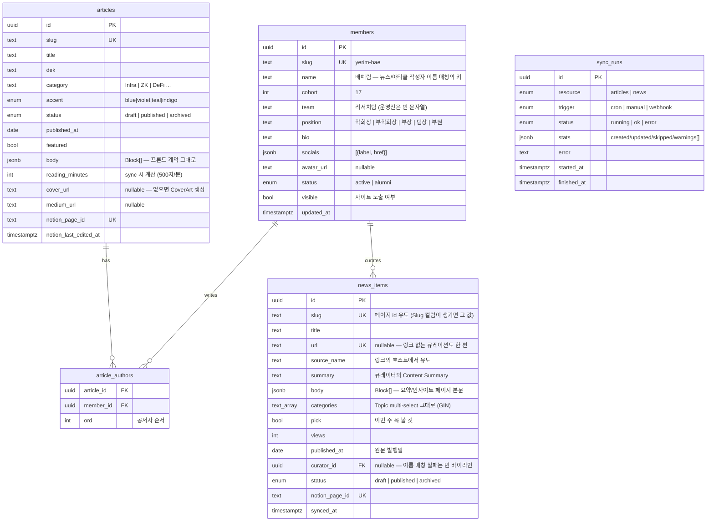

# BAY 백엔드 설계 — 인원관리 · 리서치 · 뉴스트래킹

스택: **NestJS + PostgreSQL (Prisma)** · 콘텐츠 저작: **Notion** · 프론트: 기존 Next.js 사이트

## 0. 설계 원칙

**콘텐츠는 Notion이 어드민이다.** 리서치팀이 이미 쓰는 Notion을 저작 UI로
삼고, 백엔드는 Notion → PostgreSQL 동기화 + 읽기 전용 API만 담당한다.
어드민 페이지를 따로 만들지 않는 것이 이 설계의 가장 큰 결정이다.

**예외 — 멤버는 이 DB가 원본이다.** 리서치 노션의 팀원 문서는 로스터
(기수·팀·직책·소셜)를 담을 수 없는 형태라, 명단은
`backend/scripts/seed-members.ts`가 소유하고 편집한다. Notion의 작성자 값은
이 로스터와 **이름 매칭**으로만 연결된다.

```
┌─────────┐   sync (cron/manual)    ┌────────────┐   REST(JSON)   ┌──────────┐
│ Notion  │ ──────────────────────▶ │  NestJS    │ ─────────────▶ │ Next.js  │
│ 콘텐츠  │                         │ + Postgres │   ISR/tag 캐시 │  (기존)  │
└─────────┘                         └─(멤버 원본)┘                └──────────┘
  저작                               동기화 + 서빙                   렌더링
```

- **Postgres가 서빙 스토어**: 사이트는 절대 Notion을 직접 치지 않는다.
  Notion rate limit(평균 ~3 rps)·지연·장애가 사이트에 전파되지 않는다.
- **Notion이 소스 오브 트루스**: DB에 쓰기 경로는 sync 하나뿐. 충돌 없음.
- **프론트 계약 유지**: `lib/research.ts`의 `Block` union이 이미 Notion 블록
  형태에 맞춰 설계돼 있음("swapping this module for a Notion fetch later needs
  a mapper, not a rewrite of the renderer"). API 응답의 `body`는 정확히 이
  `Block[]` 형태로 내려서 렌더러(`article-body.tsx`)를 그대로 쓴다.

## 1. 리포지토리 / 배포 형태

- 이 리포에 **`backend/` 디렉토리**로 추가 (자체 `package.json`, 워크스페이스
  툴링 불필요). 학회 규모에서 리포 분리는 관리 비용만 늘린다.
  - 대안: 별도 리포 — 배포 권한/CI를 분리하고 싶어지면 그때 떼어내도 됨.
- 배포: 백엔드 전용 Dockerfile → Railway/Fly.io/EC2 아무거나.
  Postgres는 관리형(Neon/Supabase/RDS) 권장 — 학회 규모면 무료 티어로 충분.
- Node 22 (프론트와 동일), NestJS 11, Prisma.

**ORM: Prisma** — 스키마 파일 하나로 마이그레이션·TS 타입이 나오고 NestJS
통합이 검증돼 있다. (TypeORM도 가능하지만 마이그레이션 DX가 떨어짐.)

## 2. 데이터 모델



설계 노트:

- **인원관리 범위 = 사이트에 보이는 것 전부** — 이름·기수·팀·직책·소개·
  소셜(현행 7종 라벨)·프로필 사진. 연락처·회비·지원서 같은 내부 데이터는
  이 시스템에서 다루지 않는다(확정). 따라서 비공개 admin 스코프도 없다.
- **`avatar_url`은 리서치 페이지가 소비** — 바이라인·작가 페이지에 프로필
  사진을 쓴다. Notion 파일 URL 만료 문제(§3.4) 때문에 아바타 재호스팅은
  후순위가 아니라 **아바타 노출 시점의 전제조건**이다.
- **`article_authors` 조인 테이블** — 현재 프론트는 단일 author지만 리서치
  공저는 시간문제. 지금 조인으로 가면 프론트는 `authors[0]`만 쓰다가 준비되면
  전체를 렌더하면 된다.
- **`socials`는 JSONB** — 라벨 7종(`X | Telegram | LinkedIn | Medium |
  Instagram | GitHub | Website`)은 sync 시 검증. 조회 패턴이 "멤버당 전부"
  하나뿐이라 정규화 이득이 없다.
- **`body`는 JSONB** — 블록을 행으로 쪼갤 이유가 없다(항상 통째로 읽음).
  검색이 필요해지면 `body` 텍스트를 뽑아 `tsvector` 컬럼 추가(v2).
- **카테고리는 텍스트 컬럼** — 태그 칩 목록은 `SELECT DISTINCT category`로
  유도(현재 `TAGS` 유도 방식과 동일). Notion select 옵션이 곧 카테고리 목록.
- **삭제는 소프트** — Notion에서 페이지를 아카이브하면 `status: archived`로
  전환. 하드 삭제 없음(실수 복구 가능).
- 인덱스: `articles(status, published_at DESC)`, `news_items(status,
  published_at DESC)`, `members(cohort, team)`.
- **기수/모집 상태**(`CLOSED_COHORT`/`NEXT_COHORT`)는 v1에서는 프론트 상수
  유지. 옮기고 싶으면 `site_settings` 단일행 JSONB 테이블 하나면 끝.

### Prisma 스키마

실물은 `backend/prisma/schema.prisma` — 여기 사본을 두면 틀린 쪽이 생긴다.
위 ER 다이어그램은 조인 구조를 읽기 위한 지도일 뿐, 컬럼의 진실은 스키마
파일과 마이그레이션이다.

## 3. Notion 구조와 매핑

동기화 대상 Notion 데이터베이스는 2개(아티클·뉴스). 속성 이름은
`backend/src/notion/schema.ts`에 상수로 박는다 — Notion에서 컬럼명을 바꾸면
고칠 곳도 거기 하나다.

### 3.1 멤버 — Notion 아님

리서치 노션의 팀원 문서에는 로스터가 없다(제목·소개뿐). 명단·기수·팀·직책·
소셜·한줄소개는 `backend/scripts/seed-members.ts`가 원본이고,
`npm run seed:members`가 편집 반영 경로다(슬러그 upsert — 재실행 안전).
조직도(`/organization`)와 리서치 작성자 페이지가 같은 행을 읽는다.

### 3.2 Research DB — 페이지 본문이 곧 아티클

속성: 제목(title), Slug, Dek, 카테고리(select), Accent(select), 상태(select:
초안/발행/보관), 발행일(date), Featured(checkbox), 작성자(relation — sync가
relation 대상 페이지의 **제목을 읽어 로스터와 이름 매칭**, 다중 = 공저),
Medium URL(url), 커버(files), 커버 출처(rich_text). *아직 실 DB 미접속 —
접속 시 뉴스처럼 실측 후 속성 이름을 맞출 것(뉴스에서 전 속성이 추정과
달랐다).*

커버는 업로드(만료되는 서명 URL → 재호스팅)와 붙여넣은 URL(영구 → 그대로
저장)을 모두 받는다. 커버 출처는 서식을 살려 읽어(`toMicroformat`) 노션에서
건 하이퍼링크가 사이트에서도 링크로 나온다 — 재사용 라이선스의 표기 조건을
지키는 자리라, 커버만 있고 출처가 비면 경고를 남긴다.

**커버가 없으면 참고자료에서 가져온다.** 본문 끝 `참고자료` 섹션의 첫 링크를
읽어(`src/content/references.ts`) 그 페이지의 og:image를 카드 그림으로 쓰고
`사진: [제목](링크)`을 크레딧으로 붙인다 — 뉴스가 Source에서 og:image를
긁는 것과 같은 경로(`fetchOgImage`)다. 인용하는 글이 바뀌지 않는 한 다시
크롤하지 않는다(야간 전체 리컨실이 남의 서버를 매일 훑지 않도록).
우선순위는 **본문 첫 이미지 > 커버 > 첫 참고자료 > 생성 아트**.

**본문 매핑** — 페이지 블록 트리 → 기존 `Block` union:

| Notion 블록 | → `Block` |
|---|---|
| `heading_2` / `heading_3` | `h2` / `h3` |
| `paragraph` | `p` (빈 문단은 스킵) |
| 연속된 `bulleted_list_item` | `ul` 하나로 병합 |
| 연속된 `numbered_list_item` | `ol` 하나로 병합 |
| `quote` | `quote` (마지막 줄이 `— 출처` 꼴이면 `cite` 분리) |
| `callout` | `callout` (첫 줄 굵으면 `title`) |
| `table` + `table_row` | `table` (`has_column_header` → `head`) |
| `divider` | `divider` |
| 그 외 (이미지·임베드·코드 등) | **스킵 + sync 경고 기록** (v1 범위 밖) |

**리치텍스트 → 인라인 마이크로포맷**: 렌더러(`article-body.tsx`)가 이미
`**bold**`, `` `code` ``, `[label](href)`를 파싱하므로, Notion `rich_text`의
annotation(bold/code)과 link를 이 문법으로 직렬화한다. 렌더러 수정 없음,
XSS 표면 없음(원래부터 `dangerouslySetInnerHTML` 미사용).

### 3.3 News DB — 리서치팀의 Blockchain News Tracking (실측)

리서치팀이 매주 실제로 쓰는 보드라 어휘는 그쪽이 정한다. 실제 속성:
Title(rich_text — title 속성은 Insight라는 스크래치 필드), Source(rich_text
하이퍼링크 — 표시 텍스트는 헤드라인, 값은 href), Content Summary(rich_text),
Topic(multi_select — 복수 유지), Author(multi_select의 이름 — 로스터와 이름
매칭), Date of issue(date), Status(multi_select — "홈페이지 게시" = 발행),
Pick(checkbox), Week(미사용 — 주차는 날짜에서 유도).
**페이지 본문 = 요약/인사이트** — 아티클과 같은 블록 매핑(중첩 블록 재귀
수집 포함)으로 뉴스 상세 페이지(`/research/news/[slug]`)에 발행된다. 본문이
비면 링크-온리. 본문 이미지는 §3.4 재호스팅 대상.

### 3.4 이미지 주의점

Notion `files` URL은 **만료되는 S3 서명 URL**이다. 그대로 저장하면 며칠 뒤
깨진다. sync가 다운로드해서 자체 스토리지(S3/R2 버킷 하나)에 올리고 그 URL을
저장한다.

- **뉴스 본문 이미지가 실사용처** — sync가 다운로드 → 콘텐츠 해시 키로
  버킷 업로드(같은 바이트 재업로드 없음). `S3_*` 미설정이면 경고와 함께
  Notion URL을 유지한다 — 로컬에선 충분하고, **프로덕션에선 한 시간 안에
  깨지므로 반드시 설정**.
- 아바타는 현재 전원 null(이니셜 폴백) — 사진을 받으면 같은 경로를 쓴다.
- 아티클 커버도 같은 경로를 쓴다. 미뤄뒀던 이유(“어차피 `CoverArt`가
  폴백”)는 폴백이 곧 결과가 되면서 사라졌다 — 뉴스는 발행사 og:image로
  사진이 깔리는데 리서치만 전부 생성 아트라, 같은 사이트의 두 탭이 다른
  물건처럼 보였다.

## 4. 동기화 설계

```
NotionSyncService
├─ cron: */10 분마다 증분 sync (@nestjs/schedule)
├─ POST /v1/sync/:resource  ← 운영진 수동 트리거 (X-Sync-Key 헤더)
├─ POST /v1/webhooks/notion ← (선택) Notion webhook 수신 → 디바운스 → 해당 리소스 sync
└─ cron: 매일 04:00 전체 리컨실 (아카이브/삭제 반영 누락 방지)
```

- **증분**: data source query를 `last_edited_time > cursor` 필터로 조회,
  `notion_page_id` 기준 upsert. 커서는 `sync_runs` 마지막 성공 시각.
- **순서**: articles → news. 둘 다 작성자를 DB 로스터와 **이름 매칭**으로
  해석한다(공백 무시; 동명이인은 어느 쪽도 아님 — 빈 바이라인 + 경고).
  로스터에 없는 이름의 아티클은 경고와 함께 스킵하고, seed-members로 사람을
  추가한 뒤 재싱크한다.
- **발행 게이트**: Notion 상태 속성이 `발행`인 것만 `published`. 초안은 DB에
  들어와도 API에 안 나간다.
- **실패 격리**: 페이지 하나 매핑 실패가 런 전체를 죽이지 않는다. 페이지 단위
  try/catch → `sync_runs.stats.warnings[]`에 축적. `GET /v1/sync/runs`로 확인.
- **rate limit**: 평균 ~3 rps — 순차 처리 + 429 백오프. 학회 규모(수십 페이지)
  에서는 전체 리컨실도 수 분 안에 끝난다.
- **캐시 무효화**: sync가 변경을 감지하면 Next.js revalidate 엔드포인트 호출
  (`revalidateTag('articles')` 등). 발행 → 사이트 반영이 초 단위로 끝난다.
- SDK는 최신 Notion API 버전 사용 — 2025-09 버전부터 database가 **data
  source** 개념으로 분리됐으므로(query 대상이 data source id) 구버전 예제
  코드를 그대로 베끼지 말 것.

## 5. NestJS 모듈 구조

```
backend/src/
├── main.ts                 # helmet, CORS(사이트 도메인), validation pipe
├── app.module.ts
├── config/                 # env 검증 (DATABASE_URL, NOTION_TOKEN, NOTION_DB_*, SYNC_KEY, REVALIDATE_URL)
├── prisma/                 # PrismaService (전역)
├── notion/
│   ├── notion.service.ts   # SDK 래퍼 (data source 해석, 재귀 블록 수집)
│   ├── block-mapper.ts     # Notion 블록 → Block[]  ← 단위 테스트 1순위
│   └── schema.ts           # Notion 속성 이름 상수 (실측 어휘)
├── sync/
│   ├── sync.service.ts     # 오케스트레이션(순서·커서·리컨실)
│   ├── articles.sync.ts / news.sync.ts
│   └── sync.controller.ts  # 수동 트리거 + runs 조회 (모두 guarded)
├── members/  members.controller.ts + members.service.ts   # 읽기 전용
├── articles/ articles.controller.ts + articles.service.ts # 읽기 전용
├── news/     news.controller.ts + news.service.ts         # 읽기 전용
└── health/   # GET /health (DB ping + 마지막 sync 상태)
```

## 6. API

공개 읽기(사이트가 소비) — 전부 `Cache-Control: public, s-maxage` + ETag:

```
GET /v1/members?cohort=17&team=리서치팀&status=active
GET /v1/members/:slug                 # + 쓴 글 목록 포함
GET /v1/articles?category=ZK&author=yerim-bae&page=1&size=12
GET /v1/articles/featured
GET /v1/articles/:slug                # body: Block[] + related(같은 카테고리 우선 3개)
GET /v1/articles/categories           # 태그 칩용 distinct 목록
GET /v1/news?category=&from=&to=&cursor=   # 뉴스트래킹 피드 (cursor 페이지네이션)
GET /health
```

관리(guarded — `X-Sync-Key`):

```
POST /v1/sync/:resource               # articles | news | all
POST /v1/webhooks/notion              # 서명 검증
GET  /v1/sync/runs?resource=&limit=   # 최근 런 + 경고 확인
```

- 응답 필드는 프론트 타입(`Article`, `Author`)과 이름을 맞춘다. 프론트
  마이그레이션이 "데이터 출처만 바꾸기"가 되도록.
- 인증 없는 공개 GET만 노출 — 전부 사이트에 이미 공개되는 데이터다.
  비공개 인원 데이터(연락처·회비 등)는 이 시스템 범위 밖으로 확정했으므로
  admin 스코프 자체가 없다. guarded 엔드포인트는 sync 트리거뿐.

## 7. 현재 상태 (2026-08)

- **뉴스트래킹 — 실데이터.** 리서치 노션과 붙어 sync가 돌고, 본문 이미지
  재호스팅 경로까지 완성(프로덕션 `S3_*`만 남음).
- **멤버 — DB 소유.** `seed-members.ts`가 전체 명단(운영진 포함 37명)을
  갖고, 조직도와 작성자 페이지가 members API를 읽는다. 부팅 시 자동 시드.
- **아티클 — mock.** `seed:mock`이 실제 로스터 위에 mock 아티클만 얹는다
  (멤버·뉴스는 건드리지 않음). 실제 리서치 DB가 정해지면 뉴스처럼 실측 →
  `schema.ts` 어휘 교체 → sync 활성화 순서로 간다.

## 8. 남은 것

1. **아티클 실데이터 전환** — §3.2. 뉴스에서 배운 것: 속성 이름·타입은
   전부 실측하고, 붙기 전까지 mapper를 확정하지 말 것.
2. **아바타** — 사진이 모이면 뉴스 이미지와 같은 재호스팅 경로 사용.
3. **후순위**: webhook, 검색(tsvector).
```
